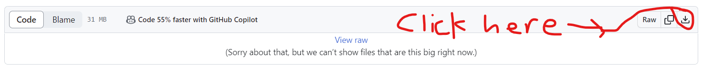

# Python Tutorial

## Instructions:
  1. You can either use Google Colab or your own Jupyter Notebook if you have Anaconda Python installed and downloaded on your local machine. You can go to this website to download **Anaconda: [link](https://www.anaconda.com/download)**. If not, you will have to download this entire folder which contains all the datasets you will be working on with the Python stuff I organized. Make sure to name your folder **00Transportation_Python_Intro** if you are going to download this folder onto your local Google Drive account. Click here to download the zip folder: [Download the ZIP file: 00Transportation_Python_Intro.zip](https://github.com/lotlouischoitslab/Computational_Transportation_Science/blob/main/00Transportation_Python_Intro/00Transportation_Python_Intro.zip)

**Here is the image for your reference:**

When mounting this folder into Google drive, be sure to rename your file path as the following:

         path = '/content/drive/MyDrive/00Transportation_Python_Intro/datasets/
         import numpy as np  IMPORTANT IF YOU WANT TO USE GOOGLE COLAB
         import pandas as pd 
         from google.colab import drive
         drive.mount('/content/drive')
         path = '/content/drive/MyDrive/03ITE_Python/datasets/'
         students = path + 'students.csv'
         df = pd.read_csv(students)
         df.head()

      If you are going to use the Jupyter notebook on your local machine, then ignore the mounting the Google drive process. All you got to do is copy the following        code into your terminal:
  
         df = pd.read_csv('datasets/students.csv')

  2. Go to this link to view the **[VIDEO](https://www.canva.com/design/DAFtbdwJChQ/_dMqvxLOOUMN5jlvxX9eHQ/edit?utm_content=DAFtbdwJChQ&utm_campaign=designshare&utm_medium=link2&utm_source=sharebutton).**
  
  3. Fill out the **00Louis_Python_Notes_Blank** and **01Louis_Python_Continued_Blank**. **00Louis_Python_Notes_Filled** and **01Louis_Python_Continued_Filled** are the ones that we have been filling in on the tutorial session. If you want more stuff, there are more code in the remaining files as well.  A couple of notes, I have not covered certain topics like inheritance and polymorphism in the video because we did not have enough time to cover them all. However, I have the code towards in the end in the **01Louis_Python_Continued** file. If you have to use those advanced concepts, feel free to check my code out. 
